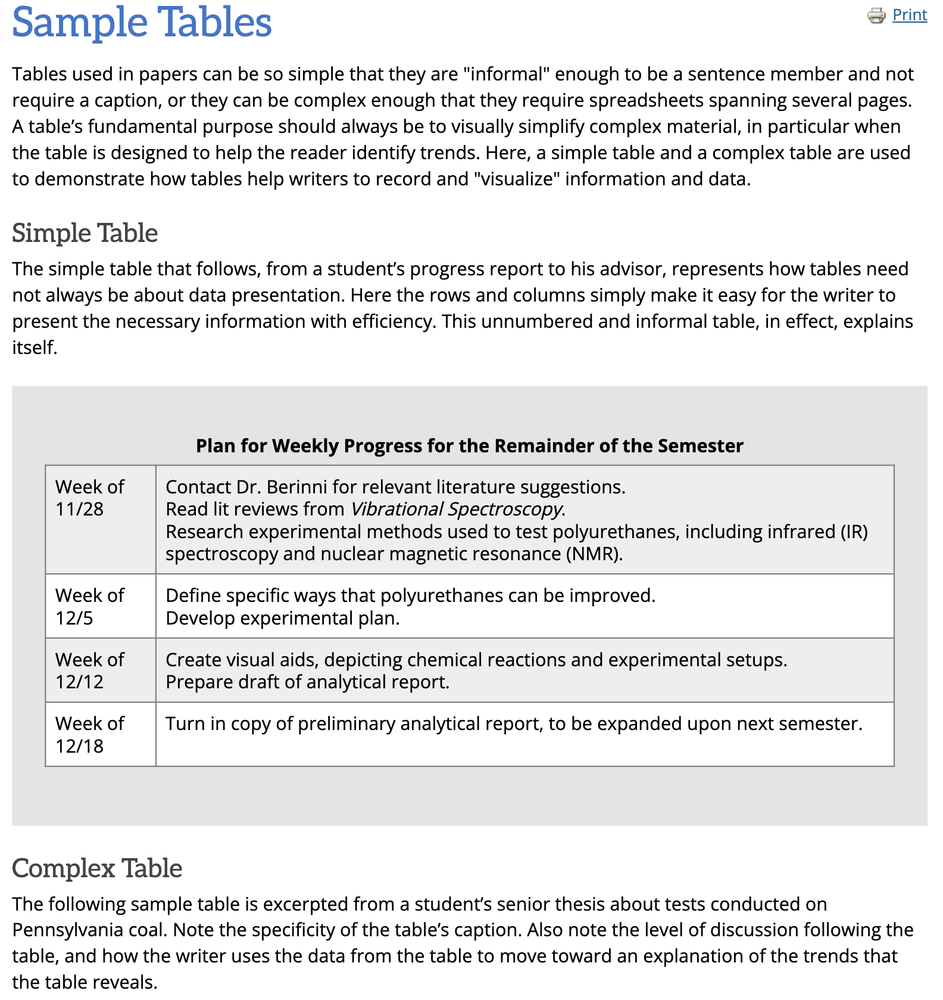

# 🧾 ocralign

`ocralign` is an OCR utility built on top of Tesseract that preserves the layout and formatting of scanned documents. It supports both PDFs and images and outputs clean, structured text.

---

## 🔧 System Requirements

Before installing the Python package, you need to install some system dependencies required by `pytesseract` and `pdf2image`:

```bash
sudo apt update
sudo apt install -y tesseract-ocr
```

## Installation
```pip install ocralign```

## Usage example
```
from ocralign import process_pdf, process_image

# OCR a single image
print(process_image("./sample.png"))

# OCR a multi-page PDF (returns list of text per page)
texts = process_pdf("./images-pdf.pdf", dpi=300)

# OCR a PDF and write result to a file
process_pdf("./images-pdf.pdf", dpi=300, output_path="test.txt")
```
### Input image:



### Extracted Text [📎 See full output here](./examples/output.txt)