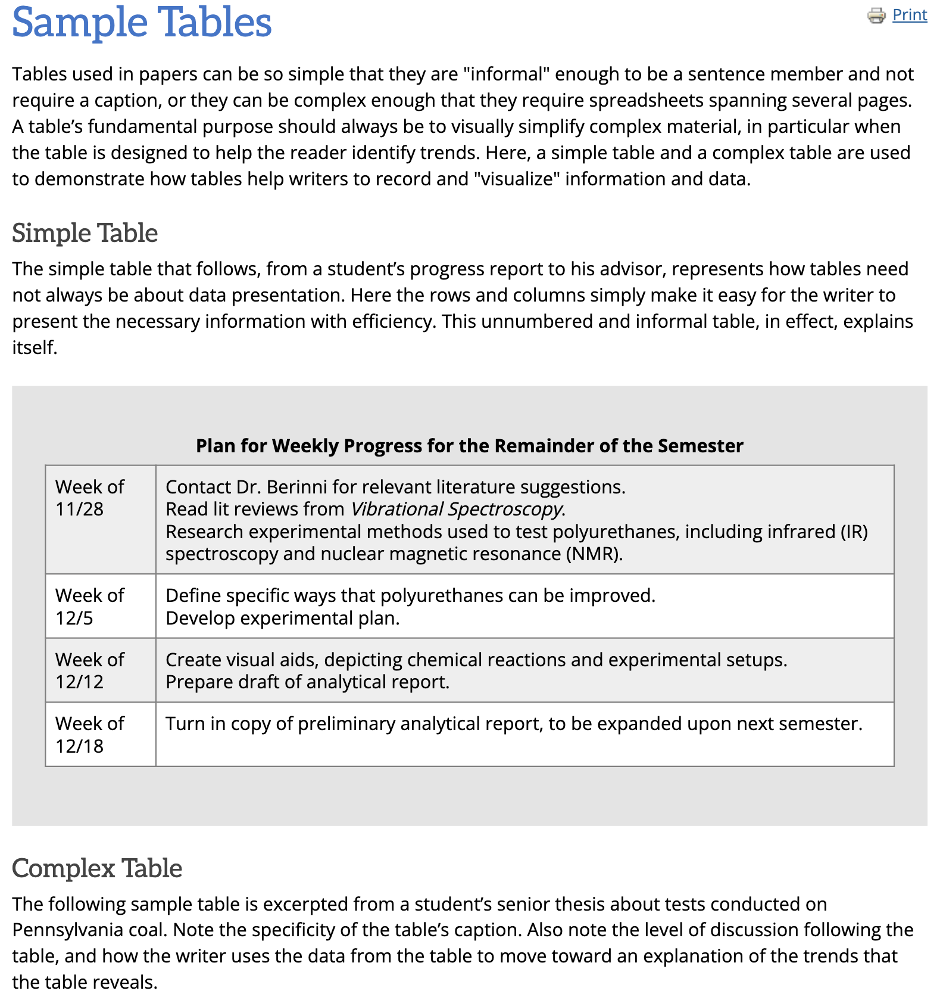

# 🧾 ocralign

`ocralign` extracts layout-preserving text from PDFs and images **plus a word-level coordinate mapping**, so any character span in the extracted text (e.g. an NER entity) can be resolved back to bounding boxes on the original page — for drawing highlight overlays in a PDF viewer, PIL/cv2, or anything else.

The core is engine-agnostic: backends emit one canonical schema, and all locate/overlay logic runs on that schema. Two backends are built in:

| | `backend="vanilla"` (default) | `backend="docling"` |
|---|---|---|
| Engine | Tesseract (scans) / PyMuPDF text layer (digital) | Docling layout models + Tesseract or RapidOCR |
| Output text | Visually formatted monospace grid (mirrors the page) | Structural markdown (headings, pipe tables, reading-order paragraphs) |
| Multi-column pages | Interleaves columns | Correct reading order |
| Tables | Flattened by (x,y) proximity | Recognized structure, rendered as pipe tables |
| Cost (CPU) | ~1–2 s/page | ~25–35 s/page (2-core CPU; GPU supported via `device="cuda"`) |
| Install | Base package | `pip install "ocralign[docling]"` (~1 GB+ with models) |

Both emit identical `Word`/`Page`/`Document` data, so `locate()` and overlays work the same regardless of backend. Use vanilla for simple single-column documents; switch to docling when a document has tables or multi-column layout and the text feeds an LLM/NER.

---

## 🔧 System Requirements

```bash
sudo apt update
sudo apt install -y tesseract-ocr
```

## Installation
```bash
pip install ocralign             # vanilla backend only
pip install "ocralign[docling]"  # + docling backend (layout/table models, rapidocr)
```

## Usage

```python
from ocralign import process_pdf, process_image, locate, locate_substring, to_pixels

# Vanilla backend (default): visually formatted text
doc = process_pdf(
    "./scan.pdf",
    type="image",        # "image" for scanned PDFs (OCR), "digital" for PDFs with a text layer
    layout="normalized", # "normalized" (readable), "absolute" (proportional vertical gaps), "none" (plain)
    dpi=300,
)

page = doc.pages[0]
print(page.text)                 # layout-aligned text, same formatting as before
print(page.words[0])             # Word(text='Sample', bbox=(0.014, 0.02, ...), confidence=96.1,
                                 #      line_no=0, char_start=18, char_end=24)

# OCR a single image -> Page
page = process_image("./sample.png")

# Docling backend: structural markdown for complex layouts.
# Detects born-digital vs scanned automatically (no `type` parameter).
doc = process_pdf(
    "./two_column_with_tables.pdf",
    backend="docling",
    ocr_engine="rapidocr",   # or "tesseract" (rapidocr is the engine with a GPU path)
    device="cpu",            # "cuda" to run OCR + layout models on GPU
    workers=4,               # CPU page-parallelism: N processes, pages merged in order
    num_threads=4,           # per-process thread cap (torch + ONNX Runtime)
)
print(doc.pages[0].text)     # "## Heading\n\nParagraph...\n\n| cell | cell |..."
```

**Scaling on CPU**: `workers=N` converts pages in N processes (each loads its own
model copies, ~1-1.5 GB RSS; defaults `num_threads` to `cpu_count() // workers`).
Worth it for multi-page documents on multi-core machines; on GPU keep `workers=1`
and let the device do the batching.

> **Docling + DPI note:** Docling's OCR stage re-renders regions at 3× scale internally.
> Feed it ~100–150 DPI page images, not 300 DPI — higher input DPI roughly doubles OCR
> time for no accuracy gain.

### Coordinate mapping & overlays

Bounding boxes are `(x0, y0, x1, y1)` as **fractions of page width/height (0–1, origin top-left)** — independent of OCR DPI and of whatever size the page is later rendered at.

```python
# NER gives you a character span into page.text -> resolve to boxes.
# One box per visual line; spans that wrap lines return multiple boxes.
boxes = locate(page, char_start=120, char_end=134)

# Or search by substring (whitespace-flexible; layout spacing won't break matching)
occurrences = locate_substring(page, "Margaret Chen")

# Offsets into the full multi-page text (doc.text(add_marker=True))?
from ocralign import locate_in_document
page_boxes = locate_in_document(doc, start, end)   # -> [(page_number, bbox), ...]

# Convert to pixels for ANY render size (PIL, cv2, react-pdf, ...)
x0, y0, x1, y1 = to_pixels(boxes[0], rendered_width, rendered_height)
```

Frontend (e.g. react-pdf) needs no library at all — store the normalized boxes with your entities and draw an absolutely-positioned div at `left = x0 * renderedPageWidth`, etc.

### Persistence

```python
doc.save_json("doc.json")        # full schema: text + words + offsets, JSON round-trip
doc = Document.load_json("doc.json")
full_text = doc.text(add_marker=True)   # concatenated text with page markers
```

## Adding a new OCR engine

Write one adapter that converts the engine's native output into `List[Word]` (normalized bboxes) — see `ocralign/backends/vanilla/tesseract.py` (~60 lines) or, for a full layout-aware pipeline, `ocralign/backends/docling/`. Layout rendering, offset mapping and `locate()` work unchanged on top of it. Commercial APIs (Textract, Document AI, Azure) already return word+bbox+confidence, so their adapters are thin translations.

## Schema

```json
{
  "schema_version": "1.0",
  "pages": [
    {
      "page_number": 1,
      "width_px": 2550, "height_px": 3300,
      "text": "formatted layout text ...",
      "words": [
        {"text": "Margaret", "bbox": [0.12, 0.08, 0.22, 0.10],
         "confidence": 96.4, "line_no": 3, "char_start": 118, "char_end": 126}
      ]
    }
  ]
}
```

### Example input & overlay resolved via `locate_substring`:



[📎 See full extracted text here](./examples/output.txt)
